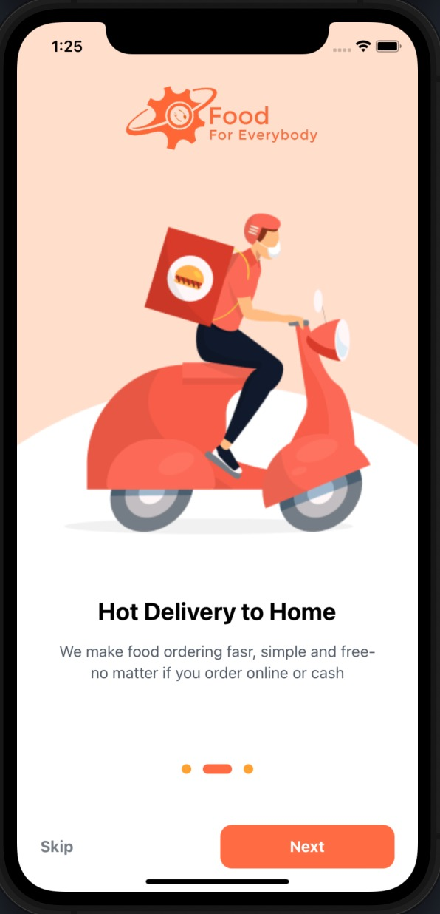
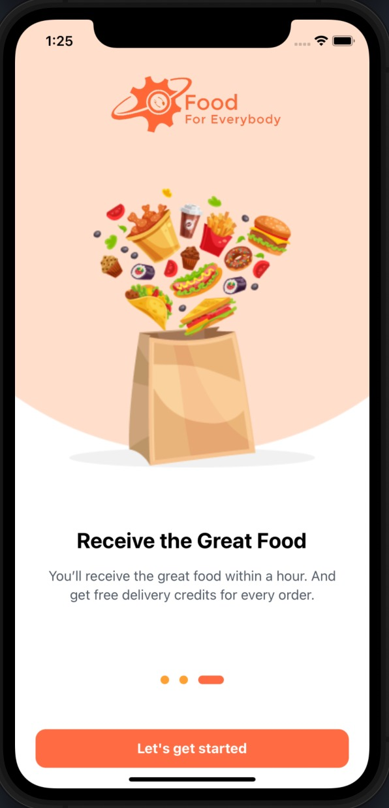
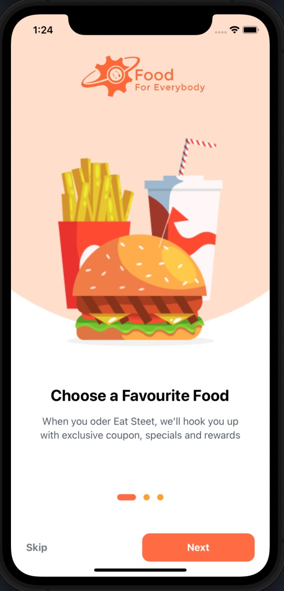
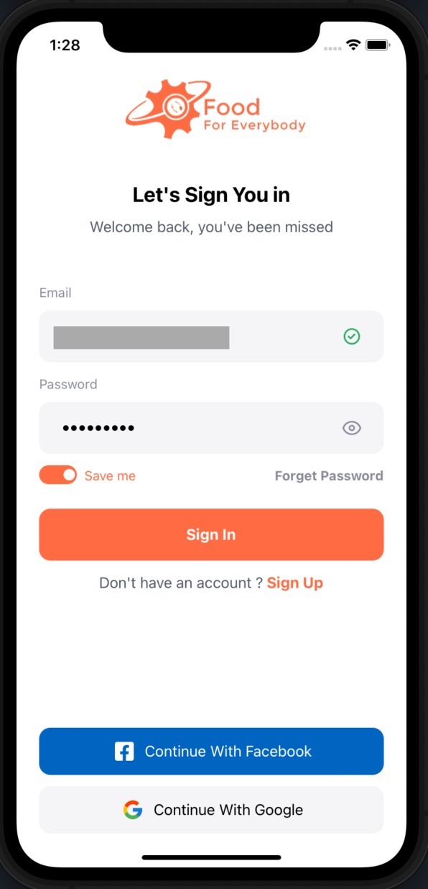
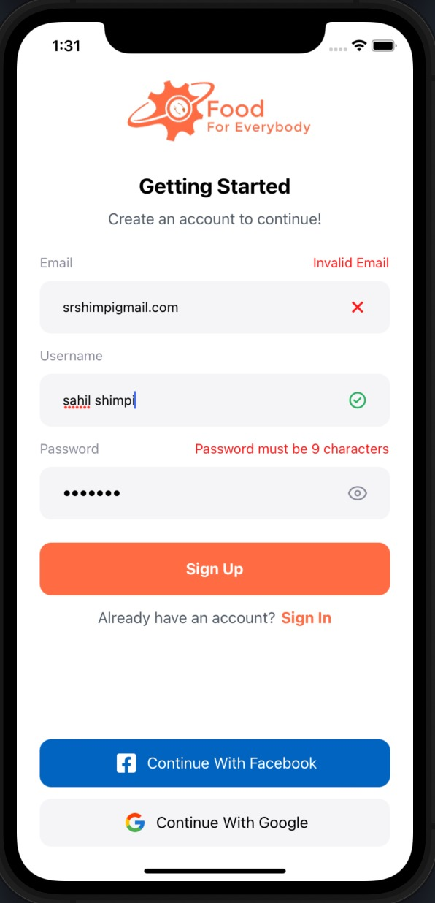
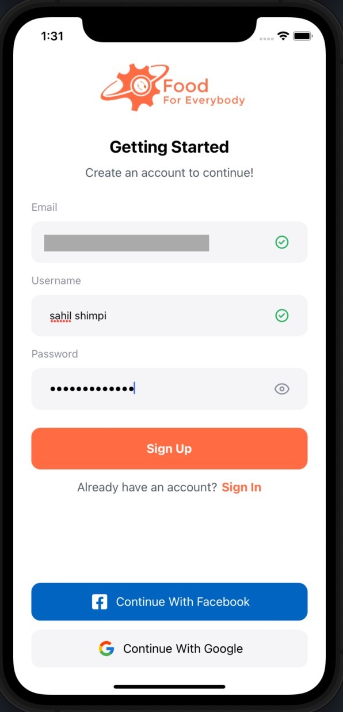
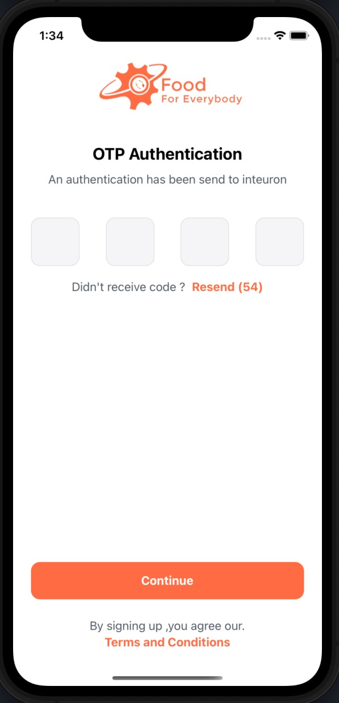

# React Native Food Delivery Application UI

This is a React Native mobile application UI for a food delivery service.

## Table of Contents

- [React Native Food Delivery Application UI](#react-native-food-delivery-application-ui)
  - [Table of Contents](#table-of-contents)
  - [Installation](#installation)
    - [Prerequisites](#prerequisites)
    - [Instructions](#instructions)
    - [npx react-native run-ios](#npx-react-native-run-ios)
    - [npx react-native run-android](#npx-react-native-run-android)
  - [Deployment](#deployment)
    - [npm run build](#npm-run-build)
  - [contribution](#contribution)
  - [Screens](#screens)
    - [Onboarding Screens](#onboarding-screens)
    - [Registration Screens](#registration-screens)
    - [OTP verification Screen](#otp-verification-screen)

## Installation

Before you can run the application, you need to install some dependencies.

### Prerequisites

- Node.js (version 12 or newer)
- React Native CLI (command-line interface)
- Xcode (for iOS development)
- Android Studio (for Android development)

### Instructions

1. Clone the repository to your local machine: git clone https://github.com/example/example.git
2. Change into the project directory:
3. Install the dependencies:

- npm install

4. If you're using iOS, run the following command to install the iOS dependencies:

- ### npx pod-install ios

5. Start the application:

- If you're using iOS, run the following command to start the iOS simulator:
  ### npx react-native run-ios
- If you're using Android, run the following command to start the Android emulator:
  ### npx react-native run-android

## Deployment

To build the application for deployment, run the following command:

### npm run build

## contribution

To contribute to this project, follow the steps below:

1. Fork the repository.
2. Create a new branch:

- ### git checkout -b &lt;branch-name&gt;

3. Make your changes and commit them:

- ### git commit -m "&lt;commit-message&gt;"

4. Push your changes to the branch:

- ### git push origin &lt;branch-name&gt;

5. Create a pull request on the original repository.

## Screens

| Screen              | Description                                                                                                                       |
| ------------------- | --------------------------------------------------------------------------------------------------------------------------------- |
| Onboarding screens  | Welcome screens for new users that guide them through the basic features and benefits of the application.                         |
| Sign-in screen      | A screen where users can sign in to their accounts or create new accounts.                                                        |
| OTP verification    | A screen where users can enter the one-time password they receive via SMS or email after signing up.                              |
| Home screen         | The main screen of the application where users can browse different restaurants and their menus.                                  |
| Restaurant screen   | A screen that displays detailed information about a specific restaurant, including the menu, reviews, and photos.                 |
| Cart screen         | A screen where users can view and edit the items they have added to their cart.                                                   |
| Checkout screen     | A screen where users can confirm their order and enter their payment and delivery details.                                        |
| Payment screen      | A screen where users can select a payment method and complete their order.                                                        |
| Order status screen | A screen where users can view the status of their current and past orders, including estimated delivery times and order tracking. |
| Sign-out screen     | A screen where users can sign out of their account and return to the sign-in screen.                                              |

### Onboarding Screens

  
  
  

### Registration Screens

  
  
  

  
  

### OTP verification Screen

  

